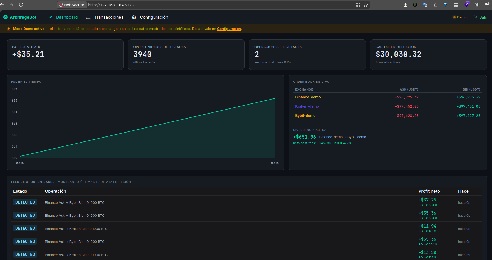
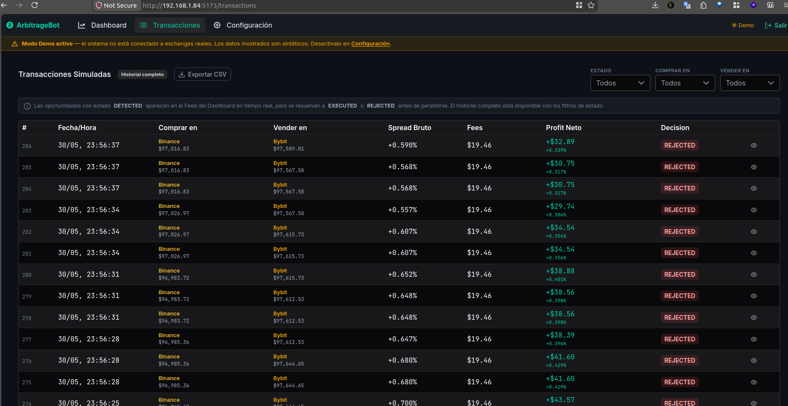
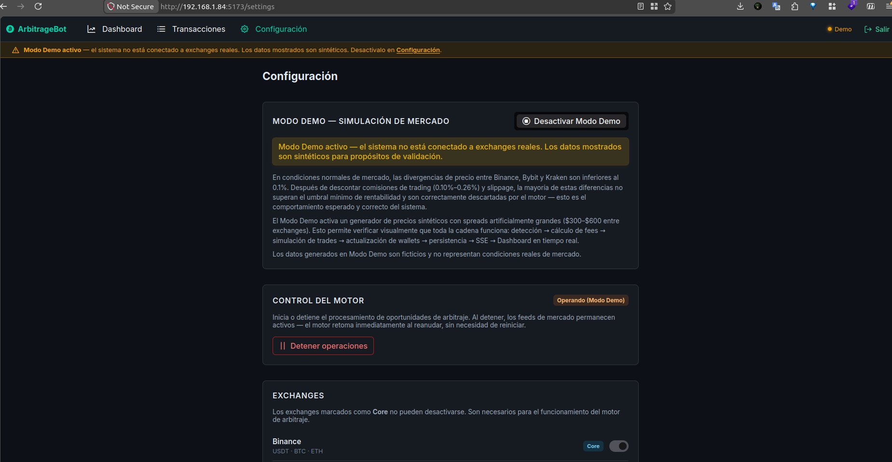

# Bitcoin Arbitrage Bot

> Sistema de detección y simulación de arbitraje de Bitcoin en tiempo real entre Binance, Bybit y Kraken. Construido con arquitectura hexagonal, diseño orientado a seguridad desde el día uno y despliegue completamente dockerizado en VPS con CI/CD automatizado.

---

## Índice

1. [Demo y acceso](#demo-y-acceso)
2. [Inicio rápido para el jurado](#inicio-rápido-para-el-jurado)
3. [Quick Start — entorno local](#quick-start--entorno-local)
4. [Arquitectura del sistema](#arquitectura-del-sistema)
5. [Solidez de lógica de negocio](#solidez-de-lógica-de-negocio)
6. [Dashboard — guía de cada elemento](#dashboard--guía-de-cada-elemento)
7. [Vista Transacciones — guía de cada campo](#vista-transacciones--guía-de-cada-campo)
8. [Vista Configuración — guía completa](#vista-configuración--guía-completa)
9. [Estrategia de tiempo real: throttling inteligente](#estrategia-de-tiempo-real-throttling-inteligente)
10. [Precisión financiera: por qué Decimal y no float](#precisión-financiera-por-qué-decimal-y-no-float)
11. [Extensibilidad: agregar un nuevo exchange](#extensibilidad-agregar-un-nuevo-exchange)
12. [Seguridad — modelo de defensa en profundidad](#seguridad--modelo-de-defensa-en-profundidad)
13. [Base de datos](#base-de-datos)
14. [CI/CD y DevSecOps](#cicd-y-devsecops)
15. [Infraestructura de producción](#infraestructura-de-producción)
16. [Observabilidad y logging](#observabilidad-y-logging)
17. [Roadmap: cómo escalar el sistema](#roadmap-cómo-escalar-el-sistema)

---

## Demo y acceso

| | |
|---|---|
| **URL pública** | `https://systemlabs.space` |
| **Email** | `operador@example.com` |
| **Contraseña** | `OperadorDemo` |
| **Modo Demo activo** | Activado por defecto — genera spreads sintéticos para validación visual inmediata |

El sistema arranca con **Modo Demo activado** y el **motor en pausa**. Para ver arbitraje en acción: ir a Configuración → presionar _Iniciar a operar_.

---

## Inicio rápido para el jurado

Para ver el sistema en acción sin instalar nada:

1. Abrir **[https://systemlabs.space](https://systemlabs.space)** en el browser.
2. Iniciar sesión con `operador@example.com` / `OperadorDemo`.
3. Ir a **Configuración** → sección _Control del Motor_ → presionar **Iniciar a operar**.
4. Volver al **Dashboard** — el feed de oportunidades comenzará a llenarse en segundos y el gráfico de P&L acumulado se actualizará con cada trade simulado.

> El sistema arranca en **Modo Demo** (adaptadores sintéticos que generan spreads de $300–$600 USD), garantizando oportunidades visibles independientemente de las condiciones reales de mercado. Para cambiar a datos reales de Binance, Bybit y Kraken, ir a Configuración → desactivar _Modo Demo_.

---

## Quick Start — entorno local

### Requisitos previos

| Requisito | Versión mínima | Verificar con | Notas |
|-----------|----------------|---------------|-------|
| Docker Engine | 24.x | `docker --version` | Único runtime requerido |
| Docker Compose | v2 (plugin) | `docker compose version` | Se invoca como `docker compose`, no `docker-compose` |
| Git | 2.x | `git --version` | Para clonar el repositorio |
| Make | cualquiera | `make --version` | Atajos del `Makefile` (opcional — los comandos `docker compose` equivalentes también funcionan) |

**Puertos que deben estar libres en el host:** `5173` (frontend), `8000` (backend API + SSE), `5432` (PostgreSQL), `6379` (Redis).

No necesitas instalar Python, Node.js, PostgreSQL ni Redis en tu máquina: todo corre dentro de contenedores.

### Instalación paso a paso

**1. Clonar el repositorio**

```bash
git clone https://github.com/crazy-valter/arbitraje-de-bitcoin
cd arbitraje-de-bitcoin
```

**2. Configurar las variables de entorno**

```bash
cp .env.example .env
```

Edita `.env` y completa, como mínimo, estas variables (sin ellas el backend aborta en el arranque):

| Variable | Descripción |
|----------|-------------|
| `ADMIN_EMAIL` | Correo del usuario administrador (login del dashboard) |
| `ADMIN_PASSWORD` | Contraseña del administrador — se hashea con Argon2id en el primer arranque |
| `ACCESS_TOKEN_SECRET` | Secreto para firmar el JWT de acceso (genera uno con `openssl rand -hex 32`) |
| `REFRESH_TOKEN_SECRET` | Secreto para firmar el JWT de refresco (distinto al anterior) |

**3. Levantar el stack completo** (backend + frontend + db + cache)

```bash
make up
```

**4. Aplicar las migraciones de la base de datos**

```bash
make migrate
```

**5. Verificar que todo esté arriba**

```bash
docker compose ps        # los 4 servicios deben estar "running"/"healthy"
make logs                # tail de logs si algo no arranca
```

**6. Acceder a la aplicación**

Abre `http://localhost:5173` e inicia sesión con el `ADMIN_EMAIL` / `ADMIN_PASSWORD` que configuraste en `.env`.

> El sistema arranca con **Modo Demo activado** y el **motor en pausa**. Para ver arbitraje en acción: ir a Configuración → presionar _Iniciar a operar_.

### Desinstalar / reiniciar desde cero

```bash
make down         # detiene los contenedores (conserva los datos)
make dev-reset    # borra volúmenes y reinicia desde cero (útil para demos)
```

### Comandos del día a día

```bash
make up           # Levanta el stack de desarrollo
make down         # Detiene los servicios
make logs         # Tail de logs de todos los servicios
make dev-reset    # Borra volúmenes y reinicia desde cero (útil para demos)
make migrate      # Aplica migraciones Alembic pendientes
make shell-backend  # Shell dentro del contenedor backend
make shell-db       # psql dentro del contenedor PostgreSQL
```

El stack de producción se levanta con:

```bash
make up-prod      # Usa docker-compose.yml + docker-compose.prod.yml
```

---

## Arquitectura del sistema

### Diagrama de servicios

```
┌──────────────────────────────────────────────────────────────────────────────────┐
│  VPS (Internet)                                                                  │
│                                                                                  │
│  Nginx (host) ──HTTPS──► Docker Network                                          │
│                                                                                  │
│   ┌─────────────────┐     REST/SSE    ┌──────────────────┐                       │
│   │    frontend     │ ◄─────────────► │     backend      │                       │
│   │   Vue.js 3      │                 │   FastAPI 0.115  │                       │
│   │   nginx:80      │                 │   Python 3.13    │                       │
│   └─────────────────┘                 └────────┬─────────┘                       │
│                                                │                                 │
│                                   ┌────────────┴────────────┐                    │
│                                   ▼                         ▼                    │
│                          ┌─────────────────┐   ┌─────────────────┐               │
│                          │       db        │   │     cache       │               │
│                          │  PostgreSQL 18  │   │    Redis 8      │               │
│                          └─────────────────┘   └─────────────────┘               │
└──────────────────────────────────────────────────────────────────────────────────┘
                                     │
              ┌──────────────────────┼──────────────────────┐
              ▼                      ▼                       ▼
        ┌──────────┐           ┌──────────┐           ┌──────────┐
        │  Binance │           │  Bybit   │           │  Kraken  │
        │ WS (pub) │           │ WS (pub) │           │ WS (pub) │
        └──────────┘           └──────────┘           └──────────┘
```

### Flujo de datos: del mercado al dashboard

```
Exchange WebSocket (ccxt.pro)
     │
     ▼  (cada tick de precio)
_on_order_book_update()
     │
     ├─► 1. Redis.save(order_book)          ← sin latencia adicional, siempre
     │
     ├─► 2. SSE: publish_orderbook()        ← throttled 500ms (solo visual)
     │         ↳ si ya se publicó hace < 500ms: skip solo este paso
     │
     ├─► 3. Redis.get_all_exchanges()       ← lee los 3 order books frescos
     │
     ├─► 4. strategy.detect(order_books)   ← ejecuta en CADA tick WS
     │         ↳ CrossExchangeStrategy: compara Ask(A) vs Bid(B)
     │              - calcula fees reales por exchange
     │              - aplica slippage estimado
     │              - filtra por MIN_PROFIT_THRESHOLD
     │
     └─► 5. _process_opportunity()          ← solo cuando hay ganancia neta
               ├─ PostgreSQL.save()         ← persiste con status DETECTED
               ├─ SSE: publish_opportunity() ← sin throttle
               ├─ TradeSimulator.simulate()  ← verifica balance, ejecuta
               │       ├─ PostgreSQL.update(EXECUTED | REJECTED)
               │       ├─ PostgreSQL.save(BuyTrade + SellTrade)
               │       ├─ WalletRepo.update(balances)
               │       └─ SSE: publish_trade_executed()
               └─ SSE: publish_wallet_update()
```

### Arquitectura hexagonal (Ports & Adapters)

El backend sigue la **arquitectura hexagonal** estrictamente. El dominio no conoce ni FastAPI, ni PostgreSQL, ni Redis:

```
core/
├── entities/          ← ArbitrageOpportunity, OrderBook, Trade, Wallet (Pydantic)
├── services/          ← ArbitrageEngine, TradeSimulator, FeeCalculator
└── strategies/        ← CrossExchangeStrategy (+ Triangular, Statistical)

ports/                 ← Interfaces puras (ABC) — el dominio solo habla con estas
├── exchange_port.py       IExchangePort
├── opportunity_repo_port.py  IOpportunityRepository
├── order_book_store_port.py  IOrderBookStore
├── event_publisher_port.py   IEventPublisher
└── config_port.py         IConfigRepository

adapters/              ← Implementaciones concretas — intercambiables
├── exchanges/
│   ├── binance_adapter.py     BaseExchangeAdapter + ccxt.pro
│   ├── bybit_adapter.py
│   ├── kraken_adapter.py
│   └── mock_exchange.py       Generador sintético para demos/tests
├── persistence/
│   ├── opportunity_repo.py    PostgreSQL vía SQLAlchemy 2 async
│   ├── trade_repo.py
│   └── wallet_repo.py
└── cache/
    ├── order_book_store.py    Redis con TTL 10s
    └── event_publisher.py     Redis Pub/Sub → SSE
```

**Ventaja práctica:** cambiar el motor de base de datos, el broker de mensajes o un exchange específico requiere solo reemplazar el adaptador correspondiente. El dominio y las estrategias no tocan nada.

### Strategy Pattern — estrategias de arbitraje

```
ArbitrageStrategyPort (ABC)
        │  detect(order_books) → list[ArbitrageOpportunity]
        │
        ├── CrossExchangeStrategy    ← Fase 1 — activa (detección entre exchanges)
        ├── TriangularStrategy       ← Fase 2 — desactivada (intra-exchange)
        └── StatisticalStrategy      ← Fase 3 — desactivada (spread histórico)
```

Las estrategias se registran en `StrategyRegistry` y se activan/desactivan desde `system_config` sin reiniciar el servicio. El engine itera sobre las activas en cada tick.

### Scoring de oportunidades

Antes de retornar las oportunidades detectadas, `CrossExchangeStrategy` las ordena por un **score de prioridad** (0.0–1.0) calculado en `core/services/scoring.py`:

| Factor | Peso | Referencia (= 1.0) |
|--------|------|--------------------|
| `net_profit_pct` — rentabilidad neta | 50% | 2% de ROI |
| `max_volume_btc` — liquidez disponible | 30% | 1.0 BTC |
| `gross_spread_pct` — spread bruto | 20% | 1% de spread |

Cada factor se normaliza a [0.0, 1.0] antes de aplicar el peso. Si el order book de alguno de los dos exchanges tiene datos stale, el score resultante se multiplica por **0.70** (penalización del 30%) — la oportunidad sigue siendo procesable si su profit neto lo justifica, pero queda deprioritizada frente a oportunidades con datos frescos.

El `score` se persiste en la tabla `opportunities` y es visible en el dialog de detalle de cada oportunidad en la vista Transacciones.

---

## Solidez de lógica de negocio

### Órdenes parciales (RF-05)

Cuando la liquidez del order book o los balances de wallet no cubren el volumen completo, el `TradeSimulator` ejecuta una **orden parcial** en lugar de rechazar la operación:

```
executable_volume_btc = MIN(
    max_volume_btc,          ← liquidez del order book (ask + bid)
    financeable_by_usdt,     ← máximo BTC comprable con el saldo USDT del comprador
    btc_balance_seller       ← BTC disponible en el exchange vendedor
)
```

Si `executable_volume_btc ≤ 0` → la oportunidad se marca `REJECTED` sin tocar ningún balance.

Si `executable_volume_btc < max_volume_btc` → los trades se marcan `PARTIAL`. Los fees y el slippage se **recalculan exactamente** sobre el volumen real ejecutado usando `FeeCalculator` (sin prorrateo lineal), garantizando que el P&L registrado refleje los costos reales de la operación parcial.

**Invariante de seguridad:** antes de ejecutar cualquier débito, el simulador valida que `buy_cost_usdt ≤ usdt_balance` y `executable_volume ≤ btc_balance_sell`. Si alguna condición falla (situación de race condition teórica), la operación se rechaza y los balances quedan intactos.

### Circuit breaker y resiliencia de feeds

El `BaseExchangeAdapter` implementa dos mecanismos de resiliencia:

**1. Circuit breaker por staleness (30s)**

Cada adaptador trackea `_last_update` con el timestamp del último tick recibido. La propiedad `feed_staleness_ms` expone cuántos milisegundos han pasado desde ese tick. Si transcurren **30 segundos sin dato**, `is_connected` pasa a `False`:

- El dashboard muestra el dot del exchange en **rojo** con la latencia real.
- El scoring aplica la **penalización del 30%** a cualquier oportunidad que use ese order book stale.
- El `RedisOrderBookStore` tiene un TTL de 10 segundos — si el feed cae, el book expira de Redis y el engine no detecta oportunidades falsas con precios vencidos.

**2. Backoff exponencial con reconexión automática**

Ante cualquier error de conexión WebSocket:

```
Intento 1 → espera 1s
Intento 2 → espera 2s
Intento 3 → espera 4s
...
Intento N → espera min(2^N, 60s)
```

Al reconectar exitosamente, el backoff se resetea a 1s. `CancelledError` (hot-swap de Modo Demo o shutdown) interrumpe el loop limpiamente sin reintentar.

---

## Dashboard — guía de cada elemento



*Vista Dashboard: monitoreo en tiempo real del motor de arbitraje — cards de P&L, oportunidades y capital, gráfico de P&L acumulado, Order Book de los tres exchanges y feed de oportunidades en vivo.*

### Cards KPI (fila superior)

#### P&L Acumulado
- **Qué muestra:** Suma de `net_profit_usdt` de todas las oportunidades con estado `EXECUTED`, leída directamente de PostgreSQL en cada ciclo de métricas (cada 5 segundos).
- **Cómo se calcula:** `SELECT SUM(net_profit_usdt) FROM opportunities WHERE status = 'EXECUTED'`
- **Fuente:** Evento SSE `metrics_update` → campo `total_pnl_usdt`.
- **Trend:** flecha verde (↑) si P&L ≥ 0, roja (↓) si negativo.

#### Oportunidades Detectadas
- **Qué muestra:** Contador de oportunidades detectadas por el motor desde el último arranque del proceso backend (contador en memoria).
- **Subvalor:** tiempo relativo de la última oportunidad recibida vía SSE.
- **Fuente:** Evento SSE `metrics_update` → campo `opportunities_detected`.
- **Nota:** este contador se reinicia con el contenedor. El historial completo está en la vista Transacciones.

#### Operaciones Ejecutadas
- **Qué muestra:** Número de trades simulados exitosamente en la **sesión actual** (desde el último arranque del backend).
- **Subvalor:** `sesión actual · tasa X%` donde la tasa es `(ejecutadas / detectadas) × 100`.
- **Fuente:** Evento SSE `metrics_update` → campo `trades_simulated`.
- **Por qué difiere del total en Transacciones:** el historial de DB incluye todas las sesiones anteriores; este contador solo cuenta la sesión actual del proceso.

#### Capital en Operación
- **Qué muestra:** Suma de todos los balances USDT (y USD) de los tres exchanges.
- **Cómo se calcula en el frontend:**
  ```
  Σ balance donde currency ∈ {USDT, USD} de todos los wallets
  ```
- **Subvalor:** cantidad de wallets con balance > 0.
- **Fuente:** Evento SSE `wallet_update` (actualización en tiempo real tras cada trade) + seed inicial desde `GET /api/wallets` al montar el dashboard.

---

### Gráfico P&L + Order Book

#### Gráfico P&L Acumulado
- **Qué muestra:** Serie temporal del P&L acumulado — cada punto es el P&L total en el momento en que se ejecutó un trade.
- **Fuente:** Eventos SSE `trade_simulated` acumulados en el store local (no persistidos; se resetea con recarga de página).
- **Eje X:** Hora local en zona horaria `America/Mexico_City`.

#### Order Book Panel
- **Qué muestra:** Mejor Ask (precio de compra) y mejor Bid (precio de venta) de cada exchange en tiempo real.
- **Spread:** diferencia porcentual entre el Ask más bajo y el Bid más alto entre todos los exchanges.
- **Fuente:** Evento SSE `orderbook_update` con throttle de 500ms por exchange (solo visual — ver sección [Throttling inteligente](#estrategia-de-tiempo-real-throttling-inteligente)).

---

### Feed de Oportunidades

- **Qué muestra:** Últimas 10 oportunidades recibidas en la sesión actual, ordenadas de más reciente a más antigua.
- **Fuente:** Eventos SSE `opportunity_detected` acumulados en el store local (memoria, hasta 500 items).
- **Columnas:**
  - `Estado` — Tag con el estado final de la oportunidad: EXECUTED (verde), REJECTED (rojo), DETECTED/EXECUTING (azul)
  - `Operación` — Exchange comprador → Exchange vendedor · volumen BTC
  - `Profit neto` — Ganancia neta después de fees + slippage, en USDT y como % del capital
  - `Hace` — Tiempo relativo desde la detección
- **¿Por qué el Feed muestra DETECTED pero la vista Transacciones no?** El evento SSE se emite con estado DETECTED inmediatamente al detectar la oportunidad. Milisegundos después, el simulador actualiza el estado a EXECUTED o REJECTED en DB. Para cuando el usuario consulta la DB, los registros ya tienen su estado final.

---

### Paneles inferiores

#### Wallets
- **Qué muestra:** Balance actual de USDT y BTC por exchange.
- **Fuente:** Evento SSE `wallet_update` + seed inicial desde API.
- **Actualización:** cada trade exitoso emite dos eventos wallet_update (exchange comprador y vendedor).

#### Estado del Bot
- **Exchanges:** latencia del feed (ms desde el último tick recibido), con dot verde (conectado) o rojo (desconectado). En Modo Demo, los exchanges muestran `(mock)` en naranja.
- **Parámetros:** umbral mínimo ROI y capital máximo por operación leídos desde la config en DB.
- **Conectividad WS:** OK si todos los exchanges tienen latencia ≥ 0.
- **Fuente:** Evento SSE `metrics_update` → campo `exchange_latencies`.

#### Sesión Estadística
- **Qué muestra:** resumen de la sesión: oportunidades detectadas, ejecutadas, rechazadas, P&L de sesión, uptime del motor.
- **Fuente:** Evento SSE `metrics_update` (se actualiza cada 5 segundos).

---

### Indicador SSE (barra superior)

| Estado | Color | Texto | Condición |
|--------|-------|-------|-----------|
| En vivo | Verde pulsante | En vivo | SSE conectado + Modo Demo desactivado |
| Demo | Naranja pulsante | Demo | SSE conectado + Modo Demo activado |
| Desconectado | Rojo fijo | Desconectado | SSE desconectado (reconectando con backoff) |

---

## Vista Transacciones — guía de cada campo



*Vista Transacciones: historial completo persistido en PostgreSQL, con filtros multi-select por estado y exchange, desglose de fees por operación y exportación a CSV.*

### Alcance de los datos

**Historial completo** — muestra todas las oportunidades registradas en PostgreSQL desde siempre, no solo la sesión actual. Paginación lazy de 50 registros por página (configurable a 25/50/100).

### Filtros disponibles

| Filtro | Opciones | Comportamiento |
|--------|----------|----------------|
| Estado | DETECTED, EXECUTING, EXECUTED, REJECTED, FAILED | Multi-select — aplica IN en la query |
| Comprar en | Binance, Bybit, Kraken | Multi-select |
| Vender en | Binance, Bybit, Kraken | Multi-select |

**Nota sobre EXECUTING:** estado transitorio que dura milisegundos. Aparece en DB solo si el proceso cae durante la simulación. Es normal ver 0 resultados al filtrar por este estado.

**Nota sobre DETECTED en DB:** ver [Feed de Oportunidades](#feed-de-oportunidades) — los registros se resuelven a EXECUTED/REJECTED antes de que el usuario pueda consultarlos.

### Columnas de la tabla

| Columna | Descripción | Fuente |
|---------|-------------|--------|
| `#` | Índice descendente (el más reciente tiene el número más alto) | Calculado: `total - offset - índice_local` |
| `Fecha/Hora` | Timestamp de detección en zona horaria `America/Mexico_City` | `opportunities.detected_at` (TIMESTAMP WITH TIME ZONE, almacenado UTC) |
| `Comprar en` | Exchange donde se ejecutaría la compra + precio Ask en ese momento | `buy_exchange`, `buy_price` |
| `Vender en` | Exchange donde se ejecutaría la venta + precio Bid en ese momento | `sell_exchange`, `sell_price` |
| `Spread Bruto` | `(sell_price - buy_price) / buy_price × 100` — porcentaje antes de costos | `gross_spread_pct` |
| `Fees` | Suma total de todos los costos (hover para desglose) | `total_fees_usdt` |
| `Profit Neto` | Ganancia neta después de todos los costos, en USDT y % | `net_profit_usdt`, `net_profit_pct` |
| `Decisión` | Estado final: EXECUTED / REJECTED / FAILED | `status` |
| `👁` | Abre dialog con desglose completo de la operación | — |

### Desglose de costos (hover sobre Fees / dialog detalle)

```
Profit bruto  =  (sell_price − buy_price) × volume_btc
Fees totales  =  trading_fee_buy  +  trading_fee_sell  +  withdrawal_fee
Slippage      =  slippage_pct × (buy_price + sell_price) / 2 × volume_btc
Red (latency) =  ajuste conservador por tiempo de ejecución
─────────────────────────────────────────────────────────
Profit neto   =  profit_bruto − fees_totales − slippage − latency_cost
```

Todos los valores se almacenan como `NUMERIC(20, 8)` en PostgreSQL y se transportan como `string` en JSON para evitar pérdida de precisión.

### Exportar CSV

Exporta la página actual filtrada. Incluye todos los campos numéricos con precisión completa. El nombre de archivo incluye la fecha de exportación.

---

## Vista Configuración — guía completa



*Vista Configuración: control en caliente del Modo Demo y del motor, ajuste de parámetros de capital y umbral de profit, edición de wallets simulados y comisiones por exchange.*

### Modo Demo

**Qué hace:** cambia los adaptadores de exchange en caliente (hot-swap) sin reiniciar el servidor.

- **Activado:** los tres exchanges reales (Binance, Bybit, Kraken) son reemplazados por `MockExchangeAdapter` que genera spreads sintéticos de $300-$600 USD para hacer visibles las oportunidades de arbitraje en el dashboard.
- **Desactivado:** se reconecta a los feeds WebSocket reales via `ccxt.pro`.
- **Persiste en DB:** el estado se guarda en `system_config.MOCK_MODE_ENABLED` y sobrevive reinicios.
- **Default de primera instalación:** activado.
- **El hot-swap:** `ArbitrageEngine.reload_exchanges()` cancela las tareas asyncio actuales, desconecta los adaptadores anteriores y lanza nuevas tasks con los adaptadores nuevos. El dashboard actualiza el indicador SSE a naranja "Demo" y el panel de Estado del Bot muestra `(mock)` en cada exchange.

**Lo que NO se puede hacer desde aquí:**
- Configurar API keys de exchanges (se configuran en `.env`).
- Cambiar el símbolo de trading (está hardcodeado a BTC/USDT).

---

### Control del Motor

**Qué hace:** pausa o reanuda el procesamiento de oportunidades sin desconectar los feeds WebSocket.

- **En pausa:** los feeds siguen activos (order books se actualizan en Redis y el Order Book Panel sigue en tiempo real), pero el motor no detecta ni simula oportunidades.
- **Reanudado:** el motor procesa en cada tick WebSocket normalmente.
- **Persiste en DB:** el estado se guarda en `system_config.ENGINE_PAUSED` — un reinicio del contenedor respeta el estado en que quedó.
- **Default de primera instalación:** pausado.
- **Botón:** "Iniciar a operar" → "Detener operaciones" (toggle con confirmación).

**Diferencia con Modo Demo:** el Modo Demo controla *qué datos* entran al motor (reales vs sintéticos). El Control del Motor controla *si el motor procesa* esos datos.

---

### Parámetros de Capital

| Parámetro | Descripción | Rango | Default |
|-----------|-------------|-------|---------|
| Monto máx. por transacción | Capital USDT máximo que el simulador usará por operación | 100 – 1,000,000 USDT | 10,000 USDT |
| Umbral mín. profit | Porcentaje mínimo de ROI neto para que una oportunidad sea considerada | 0.01% – 100% | 0.15% |

**Persisten en DB** en tabla `system_config`. Los cambios se aplican en el siguiente tick del motor (sin reinicio).

**Lo que NO se puede hacer desde aquí:**
- El umbral afecta *qué se ejecuta*, no qué se detecta. Las oportunidades debajo del umbral se generan pero se rechazan (REJECTED) antes de simularse.

---

### Exchanges

Muestra los exchanges del sistema con su estado activo/inactivo.

- Los exchanges marcados como **Core** (Binance, Bybit, Kraken) no pueden desactivarse — son requeridos para el algoritmo cross-exchange.
- El toggle de activación/desactivación reserva espacio para exchanges adicionales en futuras versiones.

---

### Wallets

Permite ajustar manualmente los balances simulados de cada wallet por exchange y moneda (USDT, BTC, ETH).

- Los cambios se persisten en la tabla `wallets` de PostgreSQL.
- Inmediatamente después de guardar, los balances se actualizan en el store del frontend.
- El motor verifica el balance antes de cada simulación — si no hay USDT suficiente en el exchange comprador, la oportunidad se rechaza con status `REJECTED`.
- Útil para demostrar el comportamiento del sistema cuando los balances llegan a cero.

---

### Comisiones (Fees)

Permite editar las fees de compra y venta por exchange.

- Los valores se persisten en `exchange_fees` y se leen en cada ciclo de detección.
- El `FeeCalculator` consulta estos valores para calcular el costo real de cada oportunidad.
- Cambiar los fees afecta las *futuras* detecciones — no recalcula el historial existente.

---

## Estrategia de tiempo real: throttling inteligente

Una de las decisiones de diseño más importantes del sistema: **el throttling afecta solo lo visual, nunca la detección de arbitraje**.

### El problema

Los WebSockets de Binance, Bybit y Kraken pueden emitir decenas de actualizaciones por segundo. Si por cada tick generamos un evento SSE al browser, saturamos la conexión HTTP/2 con datos que el ojo humano no puede procesar.

### La solución: dos canales completamente independientes

```
_on_order_book_update() se llama en CADA tick WebSocket
│
├─ [SIN THROTTLE] Redis.save(order_book)         → datos frescos para la detección
│
├─ [THROTTLE 500ms] SSE publish_orderbook()      → solo cosmético (Order Book Panel)
│        ↓
│    Si < 500ms desde último envío: early return de solo este paso
│    El resto del método SIEMPRE continúa
│
├─ [SIN THROTTLE] Redis.get_all_exchanges()      → lee los 3 books más frescos
│
├─ [SIN THROTTLE] strategy.detect(order_books)  → detección en cada tick
│
└─ [SIN THROTTLE] _process_opportunity()        → persiste, simula, notifica
```

| Canal | Throttle | Impacto en detección |
|-------|----------|---------------------|
| Redis (store de precios) | Ninguno | Siempre fresco |
| Detección de arbitraje | Ninguno | Corre en cada tick WS |
| SSE `orderbook_update` | 500ms | Solo cosmético — Order Book Panel |
| SSE `opportunity_detected` | Ninguno | Ves cada oportunidad real |
| SSE `trade_simulated` | Ninguno | Ves cada trade real |
| SSE `metrics_update` | 5 segundos | Solo estadísticas de panel |

### Por qué SSE y no WebSocket

| Criterio | SSE | WebSocket |
|----------|-----|-----------|
| Dirección | Servidor → cliente (unidireccional) | Bidireccional |
| Proxy Nginx | Simple (sin buffering) | Requiere upgrade headers |
| Reconexión | Nativa en el browser (automática) | Manual |
| HTTP/2 | Compatible con multiplexing | Separado |
| Caso de uso de este proyecto | ✅ Solo recibimos datos | ❌ No enviamos datos al servidor vía stream |

El dashboard es un consumidor puro de datos — nunca envía eventos al servidor. SSE es la herramienta correcta.

---

## Precisión financiera: por qué Decimal y no float

```python
# Floating point aritmética — produce errores de representación
>>> 0.1 + 0.2
0.30000000000000004

# Con Decimal — precisión exacta
>>> from decimal import Decimal
>>> Decimal("0.1") + Decimal("0.2")
Decimal('0.3')
```

En un sistema de trading, la diferencia entre 0.30000000000000004 y 0.3 aplicada a miles de operaciones produce errores acumulados que distorsionan el P&L. El proyecto usa `Decimal` en **todos** los valores monetarios:

- `buy_price`, `sell_price`, `net_profit_usdt` — campos `NUMERIC(20, 8)` en PostgreSQL
- Transportados como `string` en JSON (no como número) para evitar conversión a float por el parser JSON
- `FeeCalculator` usa `Decimal` en todos los cálculos intermedios
- `TradeSimulator` usa `ROUND_HALF_UP` con precisión de 8 decimales para todos los importes

Esta decisión está validada por regla de proyecto: nunca `float` para precios, fees, balances o ganancias.

---

## Extensibilidad: agregar un nuevo exchange

El sistema está diseñado para que agregar un exchange sea una operación de bajo riesgo y alcance acotado.

### Lo que ya es genérico (cero cambios)

- `ArbitrageEngine` recibe `list[IExchangePort]` — no conoce Binance ni Bybit específicamente.
- `BaseExchangeAdapter` instancia cualquier exchange de `ccxt.pro` con `getattr(ccxtpro, exchange_id)`.
- `WalletRepository` usa `exchange:currency` como clave dinámica — ya funciona con cualquier exchange_id.
- `RedisOrderBookStore` usa `exchange_id` como clave — sin cambios.
- El dashboard muestra los exchanges dinámicamente desde la DB.

### Lo que requeriría cambio hoy

```python
# main.py línea ~97 (el único lugar hardcodeado)
exchanges = [BinanceAdapter(), BybitAdapter(), KrakenAdapter()]
```

### Agregar Coinbase Pro: pasos

1. Crear `adapters/exchanges/coinbase_adapter.py` (hereda `BaseExchangeAdapter`, `exchange_id = "coinbasepro"`)
2. Registrar en `EXCHANGE_REGISTRY` (`adapters/exchanges/registry.py`)
3. Agregar fees iniciales en la migración o via Settings
4. Añadir a la lista en `main.py`

Con un `ExchangeRegistry` completo (roadmap), los pasos 3 y 4 desaparecerían — solo el paso 1.

---

## Seguridad — modelo de defensa en profundidad

El sistema trata la seguridad como requisito funcional desde el diseño, no como capa añadida post-facto (principio SSDLC).

### Modelo de amenaza

Sistema de operador único expuesto en internet. Las amenazas relevantes son:

- **Acceso no autenticado** a endpoints de escritura (`PUT /api/config`, `PUT /api/wallets`)
- **Robo de token por XSS** — código malicioso en el browser que lea credenciales
- **Fuerza bruta** sobre el endpoint de login
- **Ejecución de código arbitrario** en el contenedor (escalada de privilegios)

### Defensas implementadas

#### 1. Tokens en cookies HttpOnly — anti-XSS

```
POST /api/auth/login
→ Set-Cookie: access_token=<jwt>; HttpOnly; SameSite=Strict; Secure; Path=/
→ Set-Cookie: fingerprint=<random>; HttpOnly; SameSite=Strict; Secure; Path=/
```

JavaScript **nunca puede leer** estas cookies — la XSS más sofisticada no puede robar el token. El body de respuesta no contiene el token (ni en login ni en ningún endpoint).

#### 2. Fingerprint anti-XSS doble

```
Login:
  1. Generar fingerprint aleatorio (secrets.token_urlsafe)
  2. Guardar sha256(fingerprint) dentro del payload JWT
  3. Enviar fingerprint como cookie HttpOnly separada

Validación (cada request):
  1. Leer fingerprint de cookie
  2. sha256(fingerprint) debe coincidir con el hash en el JWT
  3. Si no coincide → 401
```

Un atacante que robe el JWT de memoria no tiene el fingerprint → el token no es usable.

#### 3. Argon2id — hashing de contraseñas

```python
PasswordHasher(
    time_cost=2,
    memory_cost=19 * 1024,   # 19 MB — inviable en GPU/ASIC
    parallelism=1,
    hash_len=32,             # 256 bits
    type=Type.ID,            # Argon2id (ganador de PHC 2015)
)
```

OWASP recomienda Argon2id como primera opción. El costo de memoria lo hace resistente a ataques de diccionario paralelos con hardware especializado.

#### 4. JWT con secretos separados y fail-fast

- `access_token` (1h) y `refresh_token` (8h) usan secretos distintos.
- Si `ACCESS_TOKEN_SECRET` o `REFRESH_TOKEN_SECRET` no están en el entorno, **el servidor aborta en startup**.
- Ningún secreto tiene valor por defecto — imposible acceder a producción con un secret olvidado.

#### 5. Blacklist de tokens en Redis

Al hacer logout, el `jti` (JWT ID único por token) se registra en Redis con TTL igual al tiempo restante del token. Cada request verifica esta blacklist — el token revocado queda inutilizable incluso si alguien lo tenía guardado.

#### 6. Rate limiting por IP

```python
slowapi: @limiter.limit("5/minute")  # login
```

El endpoint de login está limitado a 5 intentos por minuto por IP. Las rutas SSE y de configuración tienen sus propios límites.

#### 7. Contenedor non-root en producción

```dockerfile
RUN adduser --system --uid 1001 --no-create-home appuser
USER appuser
```

En caso de vulnerabilidad de ejecución de código arbitrario, el atacante opera como `appuser` sin acceso fuera de `/app`.

#### 8. Secrets sin valor por defecto

```python
def _require_secret(key: str) -> str:
    value = os.getenv(key)
    if not value:
        sys.exit(1)  # fallo explícito — no hay modo degradado
    return value
```

#### 9. SAST en CI/CD (Bandit)

El pipeline de GitHub Actions ejecuta análisis estático de seguridad (Bandit) en cada push. Un finding de severidad media o alta **bloquea el deploy**. Los reportes se publican como artefacto de la run.

#### 10. Red interna Docker — db y cache no expuestos

En producción, PostgreSQL (5432) y Redis (6379) solo son accesibles desde la red interna Docker — nunca desde internet.

---

## Base de datos

### Esquema

```
┌──────────────────┐     ┌───────────────────┐
│   opportunities  │     │      trades       │
│───────────────── │     │───────────────────│
│ id (UUID PK)     │◄───1│ opportunity_id    │
│ buy_exchange     │    N│ side (BUY/SELL)   │
│ sell_exchange    │     │ exchange          │
│ buy_price        │     │ price             │
│ sell_price       │     │ volume_btc        │
│ gross_spread_pct │     │ fee_usdt          │
│ total_fees_usdt  │     │ slippage_usdt     │
│ slippage_usdt    │     │ wallet_usdt_before│
│ net_profit_usdt  │     │ wallet_usdt_after │
│ net_profit_pct   │     │ wallet_btc_before │
│ max_volume_btc   │     │ wallet_btc_after  │
│ strategy         │     │ executed_at (TZ)  │
│ score            │     │ status            │
│ status           │     └───────────────────┘
│ detected_at (TZ) │
│ executed_at (TZ) │
│ trading_fee_buy  │     ┌───────────────────┐
│ trading_fee_sell │     │      wallets      │
│ withdrawal_fee   │     │─────────────────  │
│ network_latency  │     │ exchange + currency (PK compuesta)
└──────────────────┘     │ balance (NUMERIC) │
                         │ updated_at (TZ)   │
┌──────────────────┐     └───────────────────┘
│  system_config   │
│──────────────────│     ┌──────────────────┐
│ key (PK)         │     │  exchange_fees   │
│ value            │     │──────────────────│
│ updated_at (TZ)  │     │ exchange (PK)    │
└──────────────────┘     │ fee_buy          │
                         │ fee_sell         │
┌──────────────────┐     └──────────────────┘
│   admin_users    │
│──────────────────│     ┌──────────────────┐
│ id (UUID PK)     │     │ exchange_config  │
│ email (unique)   │     │──────────────────│
│ password_hash    │     │ exchange_id (PK) │
│ created_at (TZ)  │     │ display_name     │
└──────────────────┘     │ is_active        │
                         │ core (bool)      │
                         └──────────────────┘
```

### Decisiones de diseño

**Todos los timestamps son `TIMESTAMP WITH TIME ZONE`:** almacenados en UTC, convertidos a `America/Mexico_City` en el frontend. Compatible con asyncpg >= 0.24 que rechaza datetimes naive en columnas timezone-aware.

**Valores monetarios como `NUMERIC(20, 8)`:** 20 dígitos en total, 8 decimales — suficiente para BTC con precisión de satoshi. Nunca `FLOAT` o `DOUBLE PRECISION` para evitar error de representación IEEE 754.

**Desglose de fees en opportunities:** además de `total_fees_usdt`, cada oportunidad almacena `trading_fee_buy_usdt`, `trading_fee_sell_usdt`, `withdrawal_fee_usdt` y `network_latency_ms` — permite auditar exactamente de dónde viene cada costo.

**Snapshot de wallets en trades:** cada trade guarda el balance *antes* y *después* de la operación (`wallet_usdt_before/after`, `wallet_btc_before/after`). Esto permite reconstruir el estado del portafolio en cualquier punto histórico.

### Migraciones (Alembic)

```
0001_create_tables.py
0002_add_exchange_config.py
0003_fees_buy_sell_eth_wallets.py
0004_opportunity_fee_breakdown_trade_wallet_snapshot.py
0005_timestamps_with_timezone.py     ← conversión a TIMESTAMPTZ (asyncpg compat)
```

Las migraciones se ejecutan automáticamente en el startup de producción (`entrypoint.sh`). Cada migración es idempotente — los reinicios del contenedor no duplican datos.

---

## CI/CD y DevSecOps

### Pipeline: 3 stages en GitHub Actions

```
push a main ───────────────────────────────────────┐
                                                   ▼
                                          ┌──────────┐     ┌──────────┐
                                          │   test   │────▶│  build   │
                                          │          │     │          │
                                          └──────────┘     └──────────┘

release published ─────────────────────────────────┐
                                                   ▼
                                          ┌──────────┐     ┌──────────┐     ┌─────────────────────┐
                                          │   test   │────▶│  build   │────▶│       deploy        │
                                          │          │     │  + tag   │     │  webhook → VPS pull │
                                          └──────────┘     └──────────┘     └─────────────────────┘
```

El **deploy solo se dispara al publicar un release** desde la UI de GitHub — un push directo a `main` ejecuta test + build pero no despliega. Esto permite validar que las imágenes construyen correctamente antes de decidir qué commit promover a producción.

### Stage: test

| Job | Herramienta | Bloquea si falla |
|-----|-------------|-----------------|
| lint-backend | Ruff (E, F, I, N, UP, B, SIM, TCH) | Sí |
| sast-bandit | Bandit (-ll: medium+) | Sí |
| lint-frontend | ESLint + eslint-plugin-vue + @vue/eslint-config-typescript | No (`continue-on-error: true`) |

El stage `build` tiene `needs: [lint-backend, sast-bandit]` — el linter de frontend no bloquea la construcción de imágenes. Se ejecuta para visibilidad, pero un fallo no detiene el pipeline.

**Bandit SAST** detecta: hardcoded secrets, uso de `eval`, shell injection, crypto débil, SQL injection patterns. El reporte JSON se publica como artefacto de cada run.

### Stage: build

- Construye imágenes `prod` (multi-stage, target explícito) de backend y frontend.
- Publica en **GitHub Container Registry** (`ghcr.io`) con los siguientes tags:
  - `<sha>` — SHA completo del commit (inmutable, permite rollback exacto)
  - `latest` — puntero móvil al build más reciente
  - `<tag_name>` — solo en releases (ej. `v1.2.0`), crea una versión semántica permanente
- Usa layer cache del registry para acelerar builds cuando las dependencias no cambian.

### Stage: deploy

- GitHub Actions envía `POST /webhook/deploy` al VPS con `Authorization: Bearer $WEBHOOK_SECRET`.
- El VPS ejecuta `docker compose pull` + `docker compose up -d --remove-orphans`.
- Deploy completamente **sin downtime** para el frontend (nginx sirve estáticos mientras el backend se reinicia).

### Filosofía SSDLC

La seguridad se integró en cada fase del desarrollo:

- **Diseño:** threat modeling y definición del modelo de amenaza antes de escribir código de auth.
- **Implementación:** AppSec reviews en cada spec (checklist de superficie de ataque).
- **CI:** SAST automático bloquea findings de seguridad en la rama principal.
- **Infraestructura:** non-root en contenedor, red interna para DB y Redis, secrets como variables de entorno.

---

## Infraestructura de producción

### Servidor

**VPS Interserver** — Linux (Ubuntu LTS) en datacenter en Estados Unidos.

**¿Por qué mostrar esta información?** Es neutral-positivo para el jurado: demuestra que el sistema está realmente desplegado y operativo, no solo ejecutándose en localhost. La ubicación del servidor en EE.UU. es relevante porque los principales exchanges (Binance US, Coinbase, Kraken) tienen infraestructura concentrada allí — latencias de 20-80ms vs los 150-200ms que tendría desde América Latina.

### Stack de producción

```
Internet
    │ HTTPS (TLS 1.3)
    ▼
Nginx (host) ─── Certbot (Let's Encrypt, auto-renovación)
    │
    │ HTTP (red interna Docker)
    ▼
┌──────────────────────────────────────────┐
│             Docker Network               │
│                                          │
│  frontend:80  ←──── proxy_pass ───────── ┤
│  backend:8000 ←──── proxy_pass /api/     │
│               ←──── proxy_pass /events   │
│                                          │
│  db:5432   (solo red interna)            │
│  cache:6379 (solo red interna)           │
└──────────────────────────────────────────┘
```

**Nginx en producción cumple tres roles:**

1. **Proxy inverso:** recibe la conexión HTTPS del browser, termina TLS, y reenvía HTTP internamente a frontend o backend según la ruta.
2. **Router de rutas:** `/*` → frontend (Vue SPA), `/api/*` → backend REST, `/events` → backend SSE.
3. **Protección de servicios internos:** PostgreSQL y Redis no tienen puertos expuestos al host — solo accesibles desde la red Docker.

No actúa como balanceador de carga (single-node) ni como orquestador (eso lo hace Docker Compose).

### Configuración SSE en Nginx (crítica)

```nginx
location /events {
    proxy_pass         http://backend:8000/events;
    proxy_set_header   Connection '';      # evita cierre por idle
    proxy_http_version 1.1;
    proxy_buffering    off;               # sin buffer — bytes al browser inmediato
    proxy_cache        off;
    proxy_read_timeout 3600s;             # mantiene conexión 1h
    chunked_transfer_encoding on;
}
```

Sin `proxy_buffering off`, Nginx acumularía los eventos SSE hasta llenar el buffer antes de enviarlos al browser — el dashboard no sería en tiempo real.

### Hardening del servidor

- **UFW firewall:** solo puertos 22 (SSH), 80 (HTTP), 443 (HTTPS) abiertos al exterior.
- **SSH:** autenticación solo por llave pública, `PasswordAuthentication no`, puerto no-estándar.
- **Actualizaciones automáticas:** `unattended-upgrades` para parches de seguridad del OS.
- **Fail2ban:** bloquea IPs tras múltiples intentos fallidos de SSH.
- **Secretos:** en variables de entorno del VPS, nunca en el repositorio. `.env.example` como referencia sin valores reales.

---

## Observabilidad y logging

### Backend — structlog

El backend usa **structlog** para logging estructurado en formato JSON. Cada log tiene contexto enriquecido automáticamente:

```json
{
  "event": "trade_simulated",
  "opportunity_id": "3fa85f64-5717-4562-b3fc-2c963f66afa6",
  "net_profit_usdt": 47.32,
  "buy_exchange": "kraken",
  "sell_exchange": "binance",
  "timestamp": "2025-05-30T14:23:01.123456Z",
  "level": "info"
}
```

Eventos clave trazados:

| Evento | Nivel | Descripción |
|--------|-------|-------------|
| `arbitrage_engine_started` | INFO | Motor iniciado con exchanges activos |
| `opportunity_detected` | INFO | Nueva oportunidad por encima del threshold |
| `trade_simulated` | INFO | Trade ejecutado con P&L final |
| `insufficient_balance` | WARNING | Trade rechazado por falta de fondos |
| `mock_mode_activated` | WARNING | Cambio a datos sintéticos |
| `arbitrage_engine_paused` | INFO | Motor pausado manualmente |
| `strategy_error` | ERROR | Fallo en la ejecución de una estrategia |

### Acceso a logs en tiempo real

```bash
# Todos los servicios
make logs

# Solo el motor de arbitraje
docker compose logs -f backend

# Filtrar solo trades ejecutados
docker compose logs backend | grep "trade_simulated"
```

### Métricas vía endpoint

`GET /api/metrics` (autenticado) expone en JSON:
- `opportunities_detected` — contador de sesión
- `trades_simulated` — trades exitosos de sesión
- `win_rate_pct` — porcentaje de éxito
- `total_pnl_usdt` — P&L total histórico desde DB
- `exchange_latencies` — latencia de feed por exchange en ms
- `uptime_seconds` — uptime del motor

**Roadmap de observabilidad:** el logging estructurado está diseñado para integrarse directamente con cualquier stack de observabilidad. Los próximos pasos naturales serían:
- **Prometheus + Grafana:** exportar métricas del endpoint `/api/metrics` como contador de Prometheus.
- **Loki:** centralizar los logs JSON de structlog para búsqueda en tiempo real.
- **Alertas:** notificación cuando `win_rate_pct` cae por debajo de umbral o `insufficient_balance` ocurre repetidamente.

---

## Roadmap: cómo escalar el sistema

### Mantenibilidad actual

La arquitectura hexagonal produce código altamente mantenible:

- **Sin dependencias cruzadas:** el dominio (`core/`) no importa nada de `adapters/`. Se puede testear la lógica de negocio sin base de datos ni exchanges reales.
- **Tests unitarios puros:** `CrossExchangeStrategy.detect()` se testea con order books ficticios, sin mocks de DB.
- **Contratos claros:** los puertos definen la interfaz exacta que cada adaptador debe cumplir — agregar un nuevo adaptador es implementar la interfaz.

### Escalabilidad horizontal

El sistema actual es un monolito bien estructurado. Escalar requeriría:

#### Opción 1: Microservicios por responsabilidad

```
market-data-service   ← WS feeds → Redis (ya desacoplado)
detection-service     ← Lee Redis, escribe a queue
execution-service     ← Consume queue, simula trades
api-service           ← REST + SSE para el frontend
```

La arquitectura hexagonal ya tiene las interfaces para este split. `IExchangePort`, `IOrderBookStore` e `IEventPublisher` son los límites de corte naturales.

#### Opción 2: Coubicación con el exchange

La latencia más crítica es el tiempo entre que ocurre el cambio de precio en el exchange y que el motor lo detecta y procesa. Hoy esa latencia tiene dos componentes:

```
Exchange datacenter → Internet → VPS → Redis → Detection
     ≈ 0ms               ≈ 30-80ms      ≈ 1ms     ≈ 1ms
```

Desplegar el motor en un servidor en el mismo datacenter que el exchange reduciría la latencia de red a **< 1ms**. Para Binance: AWS ap-northeast-1 (Tokyo) o eu-west-1 (Dublin) según el cluster activo.

#### Opción 3: Estrategias adicionales

```python
# TriangularStrategy — ya en el registry, solo requiere activarse
# Detecta: BTC/USDT → ETH/BTC → ETH/USDT dentro de un mismo exchange
# La lógica de FeeCalculator y TradeSimulator ya soporta múltiples pares

# StatisticalStrategy — cointegración histórica
# Opera cuando el spread entre exchanges se desvía de su media histórica
# Requiere: almacenar serie histórica de spreads en TimescaleDB o InfluxDB
```

#### Opción 4: Ejecución real (no simulada)

El `TradeSimulator` implementa `IExecutionPort` (implícitamente). Reemplazarlo por un `LiveTradeExecutor` que llame a las APIs privadas de los exchanges requeriría:

1. Configurar API keys en `.env`
2. Implementar `LiveTradeExecutor` contra la API de ccxt (no ccxt.pro — ccxt tiene el módulo de órdenes)
3. Agregar gestión de riesgo real (stop-loss, tamaño máximo de posición, circuito breaker)

Los wallets, el historial y el P&L ya están modelados para soportar ejecución real sin cambios en el esquema.

---

*Construido con Python 3.13 + FastAPI + Vue.js 3 + PostgreSQL 18 + Redis 8 · Desplegado en VPS Interserver · CI/CD via GitHub Actions · Arquitectura hexagonal con Strategy Pattern*
